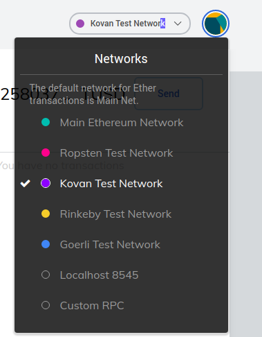
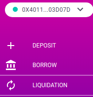
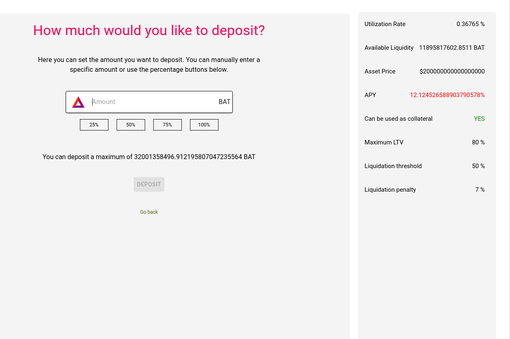
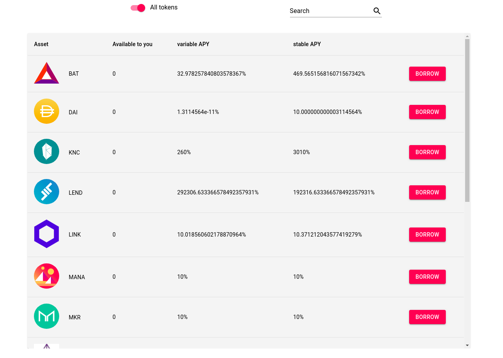
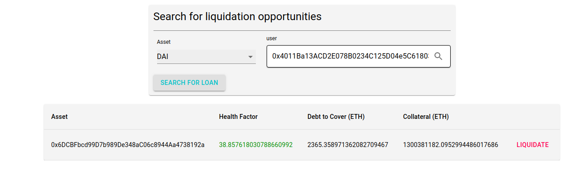
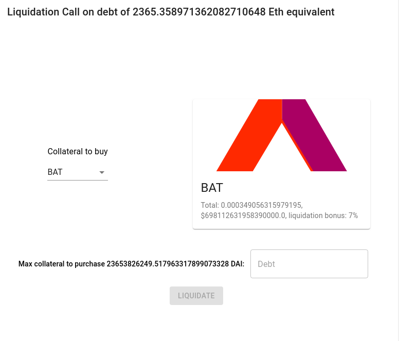

# Instructions for Defi dapp
The following document will explain how to use the Dapp from installing the wallet, acquiring tokens to using features.
The dapp has 3 features:
1. Deposit
2. Borrow against deposited capital
3. Liquidation Call on insolvent borrow positions

Currently you can't withdraw your deposits.

## Installing wallet
The dapp supports both Metamask and the Brave Crypto Wallet. If you're using the Brave browser, click on the menu and select Crypto Wallets.
If you're using another browser, install the Metamask Extension (https://metamask.io/). 

## Browser support
While the dapp should technically work in any browser that has Metamask, it has only been tested extensively in desktop versions of Chrome and Brave. 

## Working with Kovan
The dapp runs on the Kovan network which is a test network for Ethereum. Like Ethereum main net, it uses its own native Kovan eth. Kovan Eth (Keth) cannot be mined. Instead it is distributed by applications on the internet called faucets. The 2 faucets I use are https://faucet.kovan.network/ and https://gitter.im/kovan-testnet/faucet.
Be sure to get some Keth before proceeding.
Make sure the network you've selected in your wallet is Kovan and not main:

## Acquiring Tokens
Currently the tokens used on the Dapp are mock versions of the real ones. The only way to get them is to request from Shawn or myself and to supply your wallet address. 

# Deposit

go to https://gititgoro.github.io/ and connect using your wallet of choice. In the left menu you should see the deposit menu option.

Clicking on it should load the deposit page which will list all Assets as well as your Kovan balance of each. Click the deposit menu buttons to deposit each.

For the purposes of this demo, set your browser window to maximized so that you can see the stats panel. Some of the asset types on Aave can be used as collateral against loans. For the demo, we want to only deposit those assets so that we can test the loan functionality of the dapp. In the right stats check that "Can be used as collateral" is YES

## Approve
Before using the dapp, you have to give Aave permission to take tokens from your wallet. This is an ethereum transaction so clicking Approve will trigger a wallet popup event. Confirm the transaction.

## Deposit
Select any amount you wish to deposit and click the deposit button. This will also trigger a transaction confirmation event

# Borrow
Next navigate to the Borrow page by selecting the Borrow menu option on the left

The column Available to You will only be positive if you've deposited more than you've borrowed (adjusted for fees.)

Clicking on the deposit button should yield a similar experience to deposit except this time you will be borrowing against your deposited collateral.

# Liquidations

### Health Factor
Since loans are fully collateralized, one goal of the dapp is to ensure that there is always more collateral in the system than outstanding loans. Both loans and collateral accumulate interest. If the loan positions grow faster than the deposited collateral than eventually the position will move into an insolvent state. The smart contracts calculate the each user's overall viability in the system by producing a number called the health factor. If the health factor > 1 then the user is solvent. Any fraction below ones means the outstanding debt is approaching an unhealthy level relative to the collateral. We have a safety margin so that the number falls below 1 well before the user is insolvent.

### Liquidation Calls
When a user's Health Factor < 1, we can trigger a liquidation call by paying off some of their debt in exchange for seizing some of their colateral. Most users deposit a number of different collateral types against their loans. So when we issue a liquidation call, we can indicated which collateral type we'd like to receive as payment. There are a number of other elements to liquidations that are beyond the scope of this demo.

For now, navigate to the Liquidations section via the left menu:

Insert the address of a user you think has an unhealthy loan position, select the asset they're currently borrowing and click search for loan.

From the example above, the user has a healthy position as shown by the health factor of 38. The number is on the decline though so eventually this user will be ripe for liquidations. Nonetheless for the purposses of this demo, we've enabled the user the ability to attempt to liquidate healthy positions.

After bringing up a user with debt, click the liquidate button:

Here you can see the eth Value of the outstanding debt. You can also choose the collateral to be rewarded with in the drop down. Note that you're paying in the currency of the loan so if it's a Dai loan, you trigger a liquidation with Dai.